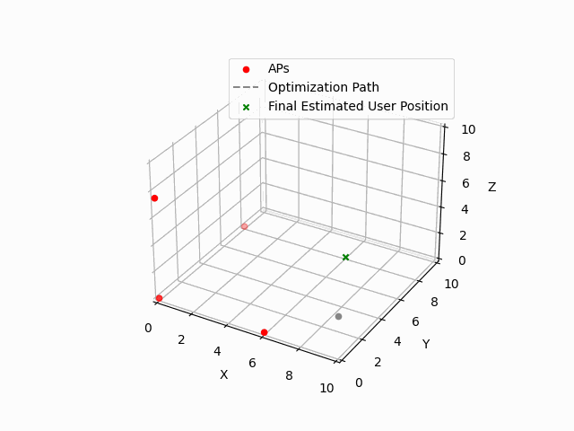

# RTT Localization using Least Squares Optimization
### [Least Squares](https://en.wikipedia.org/wiki/Least_squares)
The method of least squares is a parameter estimation method in regression analysis based on minimizing the sum of the squares of the residuals (a residual being the difference between an observed value and the fitted value provided by a model) made in the results of each individual equation. (More simply, least squares is a mathematical procedure for finding the best-fitting curve to a given set of points by minimizing the sum of the squares of the offsets ("the residuals") of the points from the curve.)

 ### [RTT_Estimation_Using_Least_Square](https://github.com/weisongwen/AAE4203-2425S1/blob/main/Sample_Codes/Wifi_RTT/RTT_Estimation_Using_Least_Square.py)

The python demo demonstrates how to estimate a user's 3D coordinates based on their distances from multiple fixed Access Points (APs) using the Least Squares Optimization technique. The project also includes a 3D visualization of the optimization process to track how the user's estimated position converges towards the correct coordinates.

  <h3 align="center">Sample code intro</h3>

### Run the demo in jupyter notebook:

- RTT_Estimation_Using_Least_Square.py

  Define the AP coordinates and measured distances.

  Run the script to estimate the user's position.

  The 3D animation of the optimization process will be saved as rtt_ls.gif.
  

  

  
 Demonstration of the LS Algorithm 

- Key Concepts
  
1. Access Points (APs): Fixed devices with known 3D coordinates.
2. User Position Estimation: Using the distances from multiple APs to estimate the user's unknown position in a 3D space.
3. Least Squares Optimization: A method used to minimize the sum of squared residuals between predicted and actual distances.
4. Residual Function: A function that calculates the difference between the predicted distance (based on a guessed user position) and the actual measured distances.

- Features
1. Optimization: The script uses SciPy's least_squares function to optimize the user's position (x, y, z) by minimizing the residuals.
2. Error Term: An additional error term is included in the optimization to account for inaccuracies in the distance measurements.
3. Visualization: The script generates a 3D animated plot showing the convergence of the estimated user position as the optimization proceeds.
